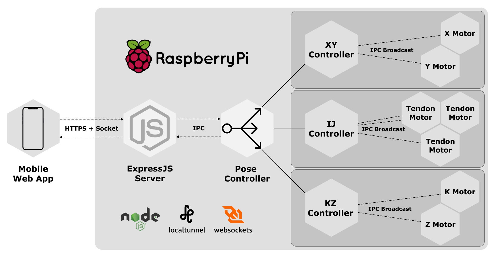

# teleultrasound

## Overall Architecture


At the moment, the above picture is mostly accurate. Each hexagon represents a separate linux process. Each of the XY/IJ/KZ controllers need to be started manually but after that, they will spawn their own motor controllers and will also kill those motor controllers when shutdown.

Ideally, at some point, this should be all built into a `npm start` script that boots up the servers for serving the mobile app, the pose controller, and the various component controllers (XY/IJ/KZ). Right now it is a Linux bash script running all the servers ```autorun```

## Operation
### Booting Up:
The device currently requires one standard 15A 120V wall plugs. First, power on the Raspberry Pi using a 5V USB power supply and micro USB cable. Then, prepare the 12V power supply for the motors. Do not connect the DC power plug to the motor control circuit until the Raspberry Pi has booted and all control programs are running.


Before starting the control programs, you must “home” the device. This must be done before any control program is started or restarted. Using the top view image (above) as a reference for your point of view, move the XY system as far as possible up and to the left. It should be sitting in the top left corner. Next, hold the KZ Module level (probe vertical), and tighten each tendon motor by hand so that they balance the KZ Module. This is the “home” position.

### Running Control Programs:
The Raspberry Pi should automatically connect to the WPI wireless network. If it does not, it may need to be reregistered with IT. Contact WPI IT for information on registering Raspberry Pi devices for wireless connectivity. You may also need to use an external monitor, mouse, and keyboard to set up the WPI wifi.
1. Once the Pi is connected to the network, you should be able to SSH into the device using its IP address. There is a script that emails the IP addresss of the Raspberry Pi in the ```mail_ip.sh``` file in the Raspberry Pi Home folder. You can edit this file to add more emails to send. See the ``How to Use Raspberry Pi and VNC`` document for more information

2. Open the terminal and run this command to start all servers:
  ```./autorun.sh```
  You will see a URL address as the last output line. Navigate to this URL using a smartphone to control the device.
  
#### Alternative Command

3. Navigate to the /autorun folder. Once in the /autorun folder, run this command to start all servers:
  ```./run-all.sh``` 

#### Alternative Steps: Manual Process for Debugging

4. Navigate to the /controller folder. Once in the /controller folder, run this command to start the control systems that run each of the modules and all of the motors:
  ```node xyController.js & node tendonController.js & node kzController.js```

  (note the single '&' between commands)

5. In another shell window navigate to the same /controller folder. Once in the /controller folder, run this command to start the pose controller that integrates all date from the motors:
  ```node poseController.js```

6. In another shell window navigate to the /server folder. Once in the /server folder, run this command to start the web server that serves the smartphone web application:
  ```node ws-server.js```

7. Finally, in order to connect to the device from a smartphone, run this command in a separate shell window:
  `lt --port 8080`

  1. This will output a url that you can use to access the control application from a smartphone. 
  2. Open the index.html file in the /server folder and change the wss access point in the script section to point to the url that the 'lt' command just gave you.
  3. Save the index.html file and refresh the page on the smartphone.
  4. You should see a "Client has connected" log line in the ws-server.js execution window.

This will output a URL pointing to the server we started in Step 1. Navigate to this URL using a smartphone to control the device.

### Shutting Down:
Upon completion of testing, stop all running processes by pressing CMD+C or CTRL+C in each shell window. Once one process closes, you can use ```killall node``` to terminate the rest. This will close the web server and disconnect all motors. Unplug the motor power supply. Finally, run the `sudo shutdown -h now` command before unplugging the Raspberry Pi power supply.


## Future work

1. Create a npm start/dev script to run all of this
2. Create a way to use a secure and fixed URL (possibly password protected) instead of the variable URL from lt
   1. Optionally, find another way to serve the application that doesn't require this step
